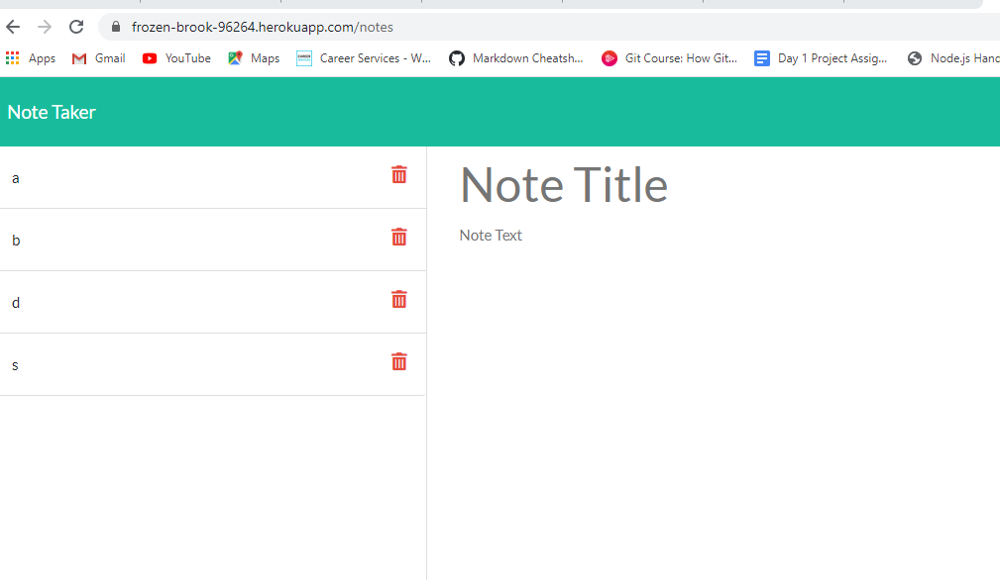

# Note-Taker app designed with Express and Node JS

## Table of Contents 

* [Installation](#installation)
* [Usage](#usage)
* [Credits](#credits)
* [MIT_License](#mit_license)

## Installation

1. Clone the repo, 
2. In the repo, run npm install and,
3. Run the server.js file in your terminal using 'node server.js'. 
4. To see deployed site, go to heroku.

## Usage 

This Note Taker was designed using Express servers in Node. It retrieves information from the client user and inputs their data into the server, where it is stored and requested by the user. This app is useful to users who are task-driven and could use an organizational tool to stay on track. It was also designed to meet the criteria for GT Full-stack Flex program homework requirements. 

Github Repository: 

[GitHub](https://github.com/ChristinaStarr19/gt-express-note-taker-homework-11)

Link to Heroku Deployed Site: 

[Heroku Deployed Site](https://frozen-brook-96264.herokuapp.com/notes)

## Credits

This was a solo project completed as homework for the Georgia Tech, FullStack Flex program. However, I recieved insight on how to generate an id dynamically so that it can be deleted by my tutor, Kevin Ferguson. My TA ,Peter Colella, acted as a sounding board for thinking through my ideas for setting up the code.

## MIT_License

Copyright (c) [2020] [Christina Cunningham Starr]

Permission is hereby granted, free of charge, to any person obtaining a copy
of this software and associated documentation files (the "Software"), to deal
in the Software without restriction, including without limitation the rights
to use, copy, modify, merge, publish, distribute, sublicense, and/or sell
copies of the Software, and to permit persons to whom the Software is
furnished to do so, subject to the following conditions:

The above copyright notice and this permission notice shall be included in all
copies or substantial portions of the Software.

THE SOFTWARE IS PROVIDED "AS IS", WITHOUT WARRANTY OF ANY KIND, EXPRESS OR
IMPLIED, INCLUDING BUT NOT LIMITED TO THE WARRANTIES OF MERCHANTABILITY,
FITNESS FOR A PARTICULAR PURPOSE AND NONINFRINGEMENT. IN NO EVENT SHALL THE
AUTHORS OR COPYRIGHT HOLDERS BE LIABLE FOR ANY CLAIM, DAMAGES OR OTHER
LIABILITY, WHETHER IN AN ACTION OF CONTRACT, TORT OR OTHERWISE, ARISING FROM,
OUT OF OR IN CONNECTION WITH THE SOFTWARE OR THE USE OR OTHER DEALINGS IN THE
SOFTWARE.
